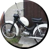
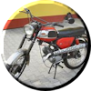

# roulette

**roulette** is roulette-like image carousel with links. It is meant to be some kind of effect to make your web site more visually attractive.

> The live demo of this directive can be found on [my personal website](http://pehu.info/html/main_mach.htm).
The source code is available on [github].

## Installation

### Install using bower

You can install roulette into your web application via bower:

````bash
bower install roulette
````

Include the bower components and roulette application components into your page:

````html
<link rel="stylesheet" href="css/roulette.min.css" type="text/css">
<script src="../jquery/dist/jquery.min.js" type="text/javascript"></script>
<script src="../angular/angular.min.js" type="text/javascript"></script>
<script src="script/roulette.min.js" type="text/javascript"></script>
````

### Install manually

If you, for some reason, want to install manually, you can do so by downloading `angular` and `jquery` files and including them to your HTML page along with the `roulette.min.js` and `roulette.min.css`.

## Usage

If everything is in place, and you have roulette added as your dependency, then just make a `div` element with `a` elements inside like this:

````html
<div ph-roulette="{delay:55, angleStep: 0.3, rotation:'cw', radius: 150, thumb: {width: 100, height: 100}, bgImage: {src:'images/wheel.png', width: 451, height: 451}}">
    <a href="html/page1.html"></a>
    <a href="html/page1.html"></a>
    <a href="html/page1.html"></a>
    <a href="html/page1.html"></a>
    <a href="html/page1.html"></a>
</div>
````

Notice the directive configuration object located in `ph-roulette` attribute:

````javascript
{
delay:55, 
angleStep: 0.3, 
rotation:'cw', 
radius: 150, 
thumb: {
    width: 100, 
    height: 100
    }, 
bgImage: {
    src:'images/wheel.png', 
    width: 451, 
    height: 451
    }
}
````

### Configuration explained

`delay` *integer*, has an influence on how fast the carousel is turning

`angleStep` *float*, an angle of rotation in each time step, has an influence on rotation "granularity / smoothness"

`rotation` *string*, can be either 'cw' or 'ccw'

`radius` *integer*, the radius in pixels, of the image orbit

`thumb` *object*, defines a thumbnail basic properties, common for all images
    `width` *integer*, the width of the thumbnail in pixels
    `height` *integer*, the height of the thumbnail in pixels    

`bgImage` *object*, OPTIONAL, defines the properties of the background image
    `src` *string*, the source of the background image
    `width` *integer*, the width of the background image
    `height` *integer*, the height of the background image
    
The background image rotates with opposite orientation. If you want it to be different, just fork and work:-)  

[github]: https://github.com/pehu71/roulette